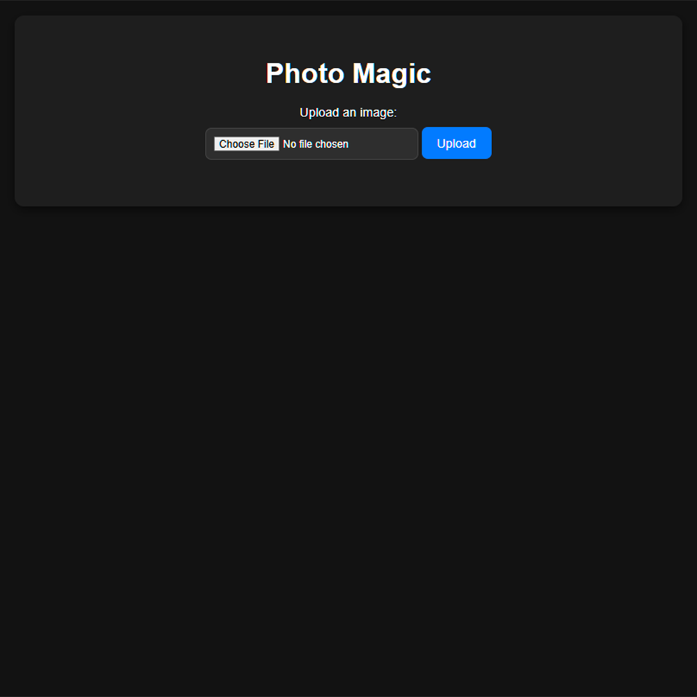
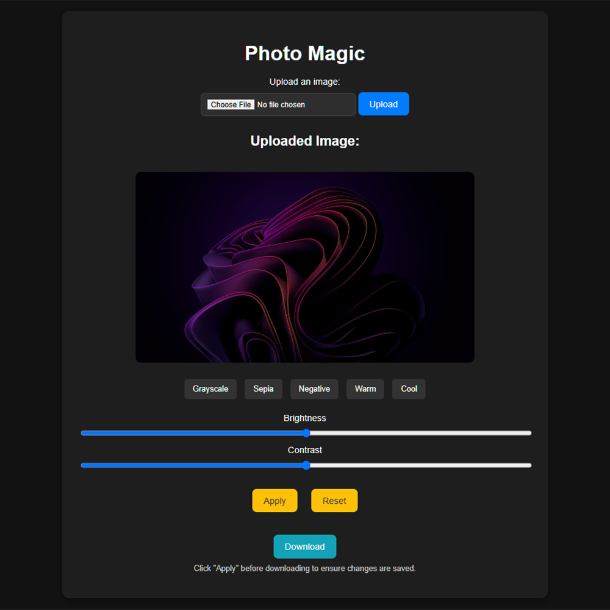
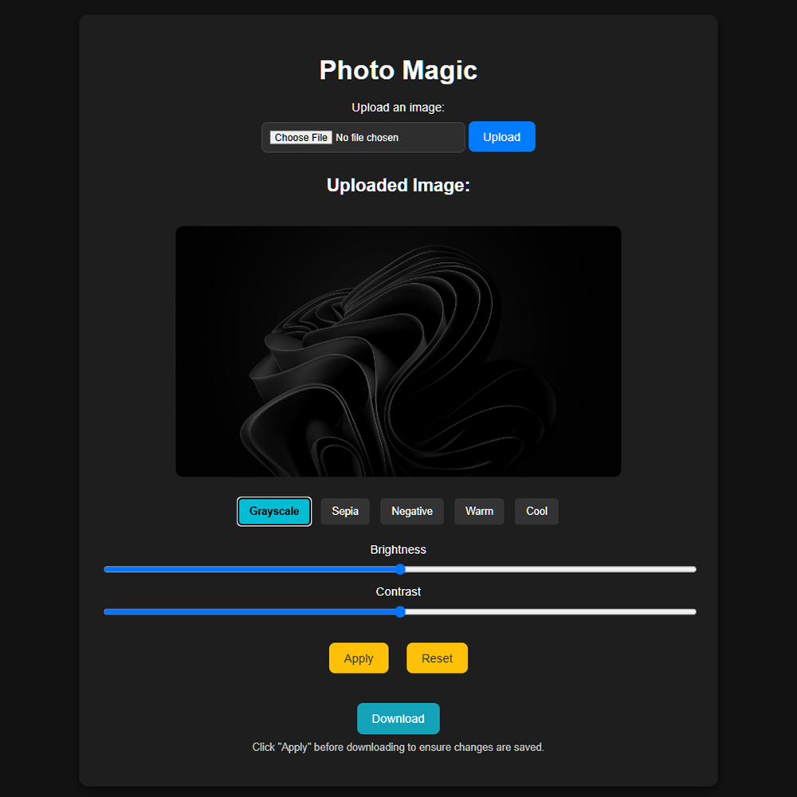
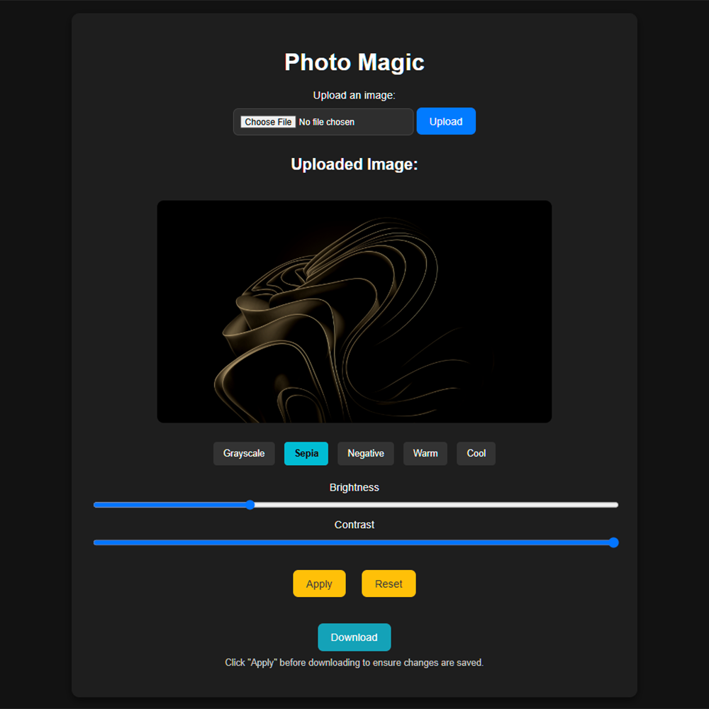

# Photo Magic

## Project Overview
Photo Magic is a a web-based photo editor that allows users to apply various filters and effects to photos.

|||
|-|-|
|||
|||

## Features
- Upload images and apply various filters (Grayscale, Sepia, Negative, Warm, Cool)
- Adjust brightness and contrast using sliders
- Revert changes to original using **Reset** button
- Download the edited image
- Real-time preview of filters and adjustments

## Dependencies
- **Flask**: For setting up the backend of the web application
- **OpenCV (cv2)**: For image processing
- **NumPy**: To manipulate image data as multi-dimensional arrays

## How to Run The Project
Follow these steps to set up and run the project on your local machine:

### Step 1: Open a Terminal or Command Prompt
Navigate to the folder where you downloaded the project files.

### Step 2: Install Required Dependencies
Install the required dependencies by running the following command in your terminal:

```
pip install Flask opencv-python numpy pillow
```

### Step 3: Run the Application
Once all dependencies are installed, run the Flask application with:

```
python app.py
```
